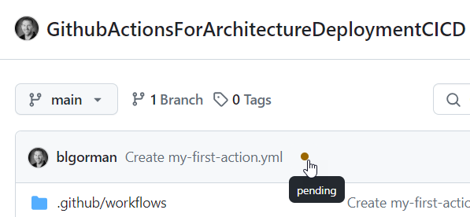
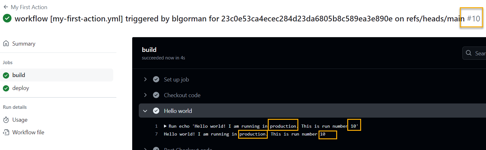

# Part 0: Before You Begin - Introduction to GitHub Actions

This `README` includes a simple getting started guide to GitHub Actions in case you have never used them or just need a quick refresher.  

## Table of Contents

- [Prerequisites](#prerequisites)
- [Getting Started](#getting-started)
    - [GitHub Actions Overview](#github-actions-overview)  
    - [Step 1: Create a new action](#step-1-create-a-new-action)
    - [Step 2: Add a trigger](#step-2-add-a-trigger)  
    - [Step 3: Add a job, step, runner, and action](#step-3-add-a-job-step-runner-and-action)
    - [Step 4: Review the action](#step-4-review-the-action)  
    - [Step 5: Run the action manually](#step-5-run-the-action-manually)  
    - [Step 6: Create a second stage](#step-6-create-a-second-stage)
    - [Step 7: Use an environment variable](#step-7-use-an-environment-variable)
    - [Step 8: Use a secret value](#step-8-use-a-secret-value)  
- [Conclusion](#conclusion)

## Next steps 

After reviewing the GitHub Actions overview, you can move on to the next parts of the walkthrough.  These parts will cover creating the architecture deployment, creating the application deployment, and additional action capabilities to maximize your efficiency.

- [Part 1: Creating the architecture deployment](Part1-CreateArchitectureDeployment.md)  
- [Part 2: Creating the application deployment](Part2-CreatingTheApplicationDeployment.md)
- [Part 3: Additional Action Capabilities](Part3-AdditionalActionCapabilities.md)  


## Getting Started

The first part of this talk/walkthrough is an overview of GitHub Actions. Here you will discover/review some of the critical concepts, including triggers, runners, jobs, steps, and actions.  You'll also get to learn about using GitHub Actions manually and automatically.

For more information on GitHub Actions, you can visit the [GitHub Actions Quickstart learning path](https://docs.github.com/en/actions/learn-github-actions/understanding-github-actions).  

## GitHub Actions Overview

To start, let's do a quick overview/review of GitHub Actions and how the structure allows you to build and action, trigger it, and run it on a runner.

### Step 1: Create a new action

First, you must create a new action.  

1. Create a repository on GitHub

    First, you need a repository.

    - [Create a new repository](https://docs.github.com/en/get-started/quickstart/create-a-repo)  

1. Create your first action

    In your new repository, click on the `Actions` tab and then click on the `New workflow` button.

      

    You will notice that there are a number of actions available out of the box. If you have a need, you would search for a match and start from there.  For example, if you wanted to build a .NET project you would search for `.NET` and select one of the appropriate actions.  

    **Select the `Set up a workflow yourself` option**.

1. Rename the file

    At the top of the file, you'll see the name `main.yml` typically.  Change this name to `my-first-action.yml`.

      

1. Name the workflow

    The name of the wofklow is the name that will appear in the Actions tab.  Add the following to the `yml` file to name the action `My First Action`:

    ```yml
    name: My First Action
    ```  

    You will see an error about missing `on` and that is ok, because you'll correct it in the next step.

      

### Step 2: Add a trigger

With the workflow started, you will need something to cause it to run. This is known as the trigger.

1. Add a trigger

    To run a workflow, you create a trigger with the keyword `on`.  This keyword is followed by an event that will trigger the workflow.  For example, you could trigger the workflow on a push to the main branch.  Add the following to the `yml` file:

    ```yml
    on:  
      # Trigger the workflow on push to main
      push:
        branches: [ "main" ]
    ```  
    
    >**Note:** Whitespace is incredibly important!  Make sure you have the correct number of spaces or the action won't work.

    You may have also notice that using a `#` allows you to add comments to the `yml` file.  This is a great way to document your workflow, but keep it clean!.

1. Add a manual trigger

    In order to trigger the action from the browser, you'll want a manual trigger.  Add the following to the `yml` file inside the `on` section under the `push` `branches`:

    ```yml
    workflow_dispatch:
    ```  

    The `workflow_dispatch` trigger allows you to run the workflow from the browser.

    The `yml` file should look like this:

      

    >**Note:** There are a number of other triggers including pull_request and the ability to trigger only when specific file paths are hit.  You can learn more about triggers [here](https://docs.github.com/en/actions/reference/events-that-trigger-workflows).

### Step 3: Add a job, step, runner, and action

In this last step for the first part of the walkthrough, you will add a job, step, runner, and action to the workflow.

1. Add a job

    A job is a set of steps that run on the same runner.  Add the following to the `yml` file:

    ```yml
    jobs:
      build:
        runs-on: ubuntu-latest
    ```  

    At this level, the `jobs` keyword is followed by the name of the job, in this case `build`.  You can name the job whatever you like but it must be unique in this action workflow.

    The `runs-on` keyword specifies the runner (build agent) that the job will run on.  In this case, the job will run on the latest version of Ubuntu. You can also specify Windows or MacOS runners.  You can [learn more about runners here](https://docs.github.com/en/actions/using-github-hosted-runners/about-github-hosted-runners).  

    >**Important**: These runners are hosted by GitHub. In more advanced scenarios, you may need to create your own runner to create efficient builds with caching or being able to run inside a virtual network or on premises.   
    
    You can [learn more about self-hosted runners here](https://docs.github.com/en/actions/hosting-your-own-runners/about-self-hosted-runners).


1. Add a step

    The first step in any workflow is typically to check out the code.  This is done with the `uses` keyword.  Add the following to the `yml` file:

    ```yml  
    steps:
      - name: Checkout code
        uses: actions/checkout@v4
    ``` 

    >**Important**: The steps must be properly indented under the job.  If they are not, the action will not run.  

    The `steps` keyword is followed by a list of steps that will run in the job.  Each step is a task that can be run on the runner.  
    
    The `name` keyword is a friendly name for the step.  
    
    The `uses` keyword is followed by the action that will be run.  In this case, the `actions/checkout@v4` action will check out the code from the repository.

    Actions are pre-built and provided by GitHub or other developers.  You can also create your own actions.  
    
    You can [learn more about actions here](https://docs.github.com/en/actions/creating-actions/about-actions).  

    In almost every workflow, you will leverage actions built by others and it will be rare to build your own.
    
1. Add an additional step to validate that the workflow is executing

    For simplicity, you'll just print out a 'hello world' message to prove that this action is working as expected.

    Add the following to the `yml` file under the checkout step:

    ```yml
      - name: Hello world
        run: echo 'Hello world!'
    ```

1. Review the file

    Your current `yml` file should look like this:

    ```yml
    name: My First Action

    on:  
    # Trigger the workflow on push to main
    push:
        branches: [ "main" ]
    workflow_dispatch:

    jobs:
    build:
        runs-on: ubuntu-latest

        steps:
        - name: Checkout code
            uses: actions/checkout@v4
            
        - name: Hello world
            run: echo 'Hello world!'
    ```  

    

1. Commit the changes to run the file

    Once you have the file saved, you can commit the changes to the repository.  This will trigger the action to run since it is a push to `main`.  You can also run the action manually from the browser after committing the changes due to the `workflow_dispatch` trigger.

    After committing, the workflow will show as pending on the main page with a yellow `circle`.  
    
    
    
    If the workflow completes it will be a green `checkmark`. 

    
    
    If the workflow fails, you'll see a red `X`.

      

### Step 4: Review the action

To complete this quick overview, you'll review the action that was run.

1. Review the action

    Click on the `Actions` tab to see the results.  

      

1. Open the logs from the action by clicking on the completed run (the link for the run where the checkmark is green).

      

1. Review the logs

    Click on the name of your job - in this case it should be `build` to see the logs

    

1. In the logs, note each part that completed.

    Notice there are some internal things that will run every time (`Set up job`, `Post Checkout code` and `Complete job`) which you didn't create.

    Then you will note the two action steps you created (`Checkout code` and `Hello world`).

    Expand a couple of the step actions to see the details of the action.

      

### Step 5: Run the action manually  

In this final step, you will run the action manually.

This will be useful because you can run the action without having to commit changes to the repository, and you can run it against any branch in your repository to see what a build might generate before committing/merging/rebasing to `main`.  

1. Run the action manually

    Navigate to the `Actions` tab and open your action:

    

    Click on the `Run workflow` button to run the action manually.  

    >**Note:** Notice that you can choose to run from a branch or a tag. Currently you should only have a `main` branch and no tags, so `main` is selected. Additionally `main` is the default selection even when you have other options.

      


1. Review the results  

    Navigate to the `Actions` tab if not already there.  Notice that a manual trigger will show the action with the name of the action `My First Action` as compared to the previous result which was named to match the commit message.

       

1.  If you want to name your run, you can do that.  

    This concept is optional and not necessarily used, but could be pretty useful if you need it.

    Add the following to the `yml` file under the `name` keyword, before the `on` keyword:

    ```yml
    run-name: workflow [my-first-action.yml] triggered by ${{ github.triggering_actor }} for ${{ github.sha }} on ${{ github.ref }}
    ```  

      

    Note that this has some extra information that is really repetitive, such as the commit and branch and user, since they are in the run logs:

    

    >**Note:** the file `my-first-action.yml` is in ythe `.github/workflows` folder.  This is where all GitHub actions are stored.  You can have multiple actions in this folder and they will all run when the trigger is hit.  

    If you need to review what the code should be, look for the `my-first-action.yml` file in the `actionsamples` folder of this repo.  

1. Trigger it again with the workflow dispatch to see the `run-name`.  

    You will note that the run-name is exactly the same as the automatic trigger.  This is because the `run-name` is a static value and does not change based on the trigger type.

    In the rare event that you would want to manually override the run name, you now have the ability to do so.

### Step 6: Create a second stage

In many workflows, the build will run and then a deployment stage will run.

Using multiple stages is entirely optional, but it is a good way to separate the build from the deployment, and prevent a deployment from trying to run if the build fails or testing fails.

1. Add a second stage

    Add the following to the `yml` file after the `build` job:

    ```yml
    deploy:
      runs-on: ubuntu-latest
      needs: build
      steps:
        - name: Deploy code
          run: echo 'Deploying code'
    ```  

    The `needs` keyword is used to specify that the `deploy` job depends on the `build` job.  This means that the `deploy` job will not run unless the `build` job completes successfully.

    The `run` keyword is used to run a command.  In this case, the command is `echo 'Deploying code'`.

    The `deploy` job will run after the `build` job completes successfully.

    Here you'll note that nothing is actually being deployed but you should be able to see where the deployment would go.

    >**Important**: In real-world workflows, you would likely have an artifact created in the first job that would be used in the second job.  This could be a zip file, a docker image, or some other artifact that is created in the first job and then used in the second job.  

    To learn more about artifacts, you can [read about them here](https://docs.github.com/en/actions/guides/storing-workflow-data-as-artifacts).

    To learn more about the github container registry, you can [read about it here](https://docs.github.com/en/packages/guides/about-github-container-registry). 

1. Review the multiple jobs build

    Navigate to the `Actions` tab and open the action.  You should see the two jobs in the action.  This is a really great way to see the separation of concerns in a GitHub action. 

      

    >**Note:** In most cases, this is actually called a `multiple-stage workflow` where the `job` is considered a `stage` so you may hear these interchangeably used.

1. You can now drill independently into each job/stage

    Review the logs to see your successful run.  Drill into the deploy job.

      

### Step 7: Use an environment variable

In this step you'll learn how to use environment variables in your GitHub actions.

This will be useful for setting values that may change if you reuse the action in different environments or in different repositories.

1. Create an environment variable

    Environment variables are created with the `env` keyword.  Add the following to the `yml` file under the `on` section before any jobs start.

    ```yml
    env:
      MY_ENVIRONMENT: 'production'
      run_number: ${{ github.run_number }}
    ```  

    Then use the variables in the hello world section:

    ```yml
    - name: Hello world
        run: echo 'Hello world!  I am running in ${{ env.MY_ENVIRONMENT }}. This is run number ${{ env.run_number }}'
    ```  

    >**Note:** The environment variable is leverages with the `${{ env.variable_name }}` syntax.  This is how you access environment variables in GitHub actions.

    Commit the changes and review the logs.

      

### Step 8: Use a secret value

In this step, you'll learn how to use a secret value in your GitHub actions.

This will be useful for setting values that should not be exposed in the logs or in the code.  For example, credentials to log in to azure or secret keys for an API or endpoint url.

1. Add a secret

    Navigate to `Settings` then choose `Secrets and variables` then chose `Actions`.  Once there, click on `New Repository Secret`.

      

    Add a secret with the name `MY_SECRET` and a value of `58dee995-845b-4d57-9770-0761933b36c6` (any random GUID works).

      

    Click `Add`.  Note that you will not be able to ever see the value of the secret again.  If you need to change it, you will need to update the value.  You can also delete the secret if you need/want to if it is no longer in use or you want to try to recreate it.

    Try to edit the secret.  You will not see the value, just a spot to enter a new one.

1. Leverage the secret in your workflow.

    Of course you will never want the value of your secret to show, so prove this out by adding the following yaml in the deployment action:

    ```yml  
    - name: Deploy code
        run: echo 'Deploying code with secret ${{ secrets.MY_SECRET }}'
    ```  
    
    Check in the code and review the logs.  What do you expect to see?

      

## Conclusion

In this README, you learned more about the purpose of this repository and had a quick refresher on working with GitHub actions, with an overview of the key moving pieces for actions.
