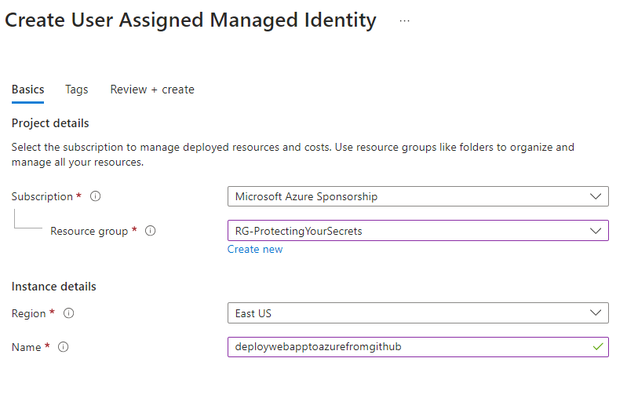

# Part 1 - Creating the architecture deployment

In this part, you will create the architecture deployment.

Because this is not an IaC exercise, the `bicep` files for the architecture are already created. You will use these files to deploy the architecture.  

If you would like to learn more about using bicep or terraform to create IaC, [please see this Azure Cloud Workshop on Infrastructure as Code](https://github.com/AzureCloudWorkshops/ACW-InfrastructureAsCode)  

The deployment will leverage a subscription deployment so you will need to make sure to have the necessary permissions to deploy to the subscription for your managed identity.

While you can and will likely someday create a managed identity with IaC, because this is a one-off operation and a chicken-and-egg problem, you will start by creating the managed identity in the portal.  You will then add federated credentials to the identity to allow it to authenticate to Azure from your GitHub Actions.  

>**Note**: If you cannot get permissions for contributor on your subscription, you could do this deployment as a group-level deployment on an existing resource group.  If this is the case, your managed identity will need contributor permissions on that specific resource group.

## Step 1: Create a service principal

In this first task, you will create a service principal that will be used to deploy the architecture and application.   

>**Consider:** Before moving on, consider what you might do to be more secure than just using a user-managed identity with contributor access on the subscription.

Assuming you would have a subscription per environment in real-world projects, you would duplicate the efforts on the production subscription and the development subscription.  

### Task 1: Create a user-managed identity in Azure for deployment

To begin, you will need to create a user-managed identity in Azure. This identity will be used to authenticate to Azure from GitHub Actions.

The UMI will be created in a resource group.  

>**Note:** You need to have a resource group to store your UMI resource. If you don't have one already, create a resource group to store your UMI resource.  

>**Note:** you could do these things in other ways (i.e. App Registration - the old way, or via the cli to create resources) but the easiest way with all the credentials and permissions in one place is to use a user-managed identity created in the portal, wired directly to your GitHub repo.  

1. Log in to the azure portal, navigate to Managed Identities, and create a new user-managed identity.  Give it a name that makes sense for the app service you are deploying to, and make sure it is in the same subscription as the app service you are deploying to.

    - Name: `mi-deployToAzureFromGitHubActions` (or whatever makes sense for your app service)
    - Resource Group: `your-resource-group`
    - Subscription: `your-subscription`
    - Region: `your-region`

    
      

1. Validate that you have the UMI created in the portal.

    

    >**Important:** Make sure to make note of the `Client ID` and `Subscription ID` of the identity, as this will be used later. This `Client ID` and `Subscription ID` in combination with the `Tenant ID` will be used to validate the federated credentials, log in to azure, and authorize from GitHub Actions secrets.

### Task 2: Add the federated credentials to the identity

Once the identity is created, you will need to add the federated credentials to the identity. This will allow the identity to authenticate to Azure from GitHub Actions.  You will explicitly name the path that lets you deploy, such as a branch (like main) or an environment (like production), or you can use a tag if you want. This is a security feature that allows you to control what the identity can do, and where it can do it (so you don't deploy to the wrong environment, for example).  

>**Note:** In this step, if you've never connected your GitHub account to azure you'l need to connect it.

1. Open the UMI and navigate to the `Federated credentials` tab.  Click `Add Credential` to add a new federated credential.

      

1. Select the `GitHub Actions Deploying Azure Resources` option.

      

1. Connect your GitHub account to Azure.  You will need to authorize Azure to access your GitHub account if you have never done this before.

    - Click `Authorize Azure` to connect your GitHub account to Azure (if needed).
    - Select the organization that contains the repository you want to deploy from.
    - Select the repository you want to deploy from.
    - For the entity, choose what makes sense to you. I personally like to use `Environment` and name it `Production` or `Test`. You could also use a branch like `main` or you can even leverage a tag if you want to be more specific or for some reason the environment option doesn't work for you (note that this is NOT a GitHub environment, it's literally just a string you will map in your action, so you could call it `mydeploymentenvironment` for all GitHub and Federated credentials care, as long as they map exactly).  However, if you want to use in tandem with GitHub Environments, you will need to name them.

    

1. Click `Add` to add the federated credential to the identity.  Review the credential is created

      

>**Note:** You could have just let the Azure app service build this for you, but the ability to use this credential built ahead of time makes the flow run more smoothtly.  

### Task 3: Ensure subscription contributor for Managed Identity

In order to deploy later, the managed identity will need to have access as a contributor on the subscription.

1. Navigate to the subscription in Azure that you will be deploying to.
1. Click on the `Access control (IAM)` link.
1. Click on the `Add role assignment` button.
1. Add the managed identity as a `Contributor` to the subscription.

    - Role: `Contributor`
    - Assign access to: `User, group, or service principal`
    - Select: `mi-deployToAzureFromGitHubActions` (or whatever you named your managed identity)

        

    >**Note:** In the real world, if you are deploying resources to a resource group, you could add the managed identity as a contributor to the resource group instead of the full subscription.  If you do this, make sure to add the managed identity to the resource group you will be deploying to instead of the full subscription.  This will be more secure, but also requires a specific resource group deployment.  The code and examples in this walkthrough are for a subscription deployment only.
    
## Step 2: Create a simple deployment

To get started and validate that the subscription is working, you will create a simple deployment that will deploy a resource group to your subscription.

If you use the sample bicep, you will get all the resources.  For that reason, you should just create a simple bicep file or use the provided `deployResourceGroup.bicep` file as the target for the deployment.  Note that the `deployResourceGroup.bicep` file is a simple bicep file that deploys a resource group to your subscription, and it is **not** used in the overall deployment (it is just a test file).

The full deployment used later will start by making sure the resource group is in place.

### Task 1: Ensure you have a simple file

Leverage the sample file or create a simple bicep file that will deploy a resource group to your subscription.  You can use the provided `deployResourceGroup.bicep` file as a starting point.

1. Open the `deployResourceGroup.bicep` file in the `bicep` folder.

    Make sure the bicep exists as follows:

    ```bicep
    param rgName string = 'RG-gha-architecture-training'
    param location string = 'centralus'

    targetScope = 'subscription'

    resource resourceGroup 'Microsoft.Resources/resourceGroups@2021-04-01' = {
        name: rgName
        location: location
    }
    ```

    >**Note:** This file is a simple bicep file that deploys a resource group to your subscription. It is **not** used in the overall deployment.

### Task 2: Add user secrets

In order to deploy, you will need to add the user secrets to the GitHub repository.  These secrets will be used to authenticate to Azure from GitHub Actions.

1. Navigate to the UMI overview in Azure.  Find the client ID and subscription ID for the UMI you created earlier.

      

    Copy the `Client ID` and `Subscription ID` to a notepad or other text/clipboard tool to use in the next steps.

1. Navigate to the GitHub repository secrets

    - Click on the `Settings` tab.
    - Click on the `Secrets` link.
    - Click on the `New repository secret` button.
    - Add the secret: `AZURE_SUBSCRIPTION_ID_DEV` and paste the `Subscription ID` as found on the UMI Overview
    - Add the secret: `AZURE_CLIENT_ID_DEV` and paste the `Client ID` as found on the UMI Overview
    
      

1. Navigate to the subscription in Azure and find the `Tenant ID` for the subscription.

      

    Copy the `Tenant ID` to a notepad or other text/clipboard tool to use in the next steps.  

1. Create the Tenant Id secret. 

  Open the GitHub repository secrets

    - Click on the `Settings` tab.
    - Click on the `Secrets` link.
    - Click on the `New repository secret` button.

  Add the secret: `AZURE_TENANT_ID` and paste the `Tenant ID`.

  >**Note:** if you are spanning tenants, make sure to create a more specific secret name, like `AZURE_TENANT_ID_DEV` or `AZURE_TENANT_ID_PROD` to differentiate between the two.

### Task 3: Ensure subscription contributor for Managed Identity


### Task 3: Create the Action to deploy the resource group test file

Now that you have the simple bicep file and the credentials in place, you will create a GitHub Action that will deploy the resource group to your subscription.

1. Navigate to the repository in GitHub that you will be deploying from.
1. Click on the `Actions` tab.
1. Click on the `New workflow` button.
1. Click on the `Set up a workflow yourself` link.
1. Replace the contents of the file with the following:

    >**Important**: Make sure your path is mapped correctly to the bicep file you want to deploy.  This example uses the `deployResourceGroup.bicep` file in the `bicep/TestFiles/` folder.  If you are using a different file, make sure to update the path in the `TEMPLATE` and `PARAMETERS` environment variables.

    ```yaml
    name: Deploy Architecture From GitHub to Azure using Bicep

    on:
      push:
        branches:
          - main
      workflow_dispatch:

    env:  
      AZURE_TENANT_ID:  ${{ secrets.AZURE_TENANT_ID }}
      AZURE_SUBSCRIPTION_ID: ${{ secrets.AZURE_SUBSCRIPTION_ID_DEV }}
      AZURE_CLIENT_ID: '${{ secrets.AZURE_CLIENT_ID_DEV }}'
      TEMPLATE: 'bicep/TestFiles/deployResourceGroup.bicep'
      PARAMETERS: 'bicep/TestFiles/deployResourceGroup.parameters.json'  
      DEPLOYMENT_NAME: 'DeployResourceGroupFromGitHubActions'
      REGION: 'centralus'

    permissions:
      id-token: write
      contents: read

    jobs:
      deploy-dev-env:
        name: Deploy Environment Architecture
        runs-on: ubuntu-latest
        environment:
          name: 'dev'

        steps:
          - name: Checkout Code
            uses: actions/checkout@v4

          - name: Log in to Azure
            uses: azure/login@v2.1.1
            with:
              client-id: ${{ env.AZURE_CLIENT_ID }}
              tenant-id: ${{ env.AZURE_TENANT_ID }}
              subscription-id: ${{ env.AZURE_SUBSCRIPTION_ID }}

          - name: Deploy Resources
            uses: Azure/arm-deploy@v2.0.0
            with:
              scope: subscription
              subscriptionId: ${{ env.AZURE_SUBSCRIPTION_ID }}
              region: ${{ env.REGION }}
              template: '${{ env.TEMPLATE }}'
              parameters: '${{ env.PARAMETERS }}'
              deploymentName: '${{env.DEPLOYMENT_NAME}}-${{github.run_number}}'
              failOnStdErr: true
    ```  

    >**Note:** This workflow will run when a push is made to the `main` branch.  Because this is a test, you can run it manually by clicking the `Run workflow` button.

1. Check in your changes and push them to the repository.

    ```bash
    git add .
    git commit -m "Add GitHub Action to deploy resource group"
    git push
    ```  

### Task 4: Validate the deployment

Make sure the deployment is successful and the resource group is created in your subscription.

1. Navigate to the repository in GitHub.
1. Click on the `Actions` tab.
1. Click on the `Deploy Architecture From GitHub to Azure using Bicep` workflow.
1. Click on the latest run to view the details.
    
    Ensure the deployment completed.

    >**Note:** If the deployment failed, check the logs in the GitHub Action to see what went wrong.  You can also check the deployment in the Azure portal to see the error message. The most common issues are listed below.

    Most Common Issues:

    - The managed identity does not have contributor access to the subscription.
    - The managed identity does not have the correct federated credentials.
    - The path to the bicep file is incorrect (typos, wrong folder, backwards slashes, etc).
    - The bicep file is incorrect (typos, wrong parameters, etc).
    - The parameters file is incorrect (typos, wrong parameters, etc).
    
1. Navigate to the Azure portal and validate the resource group was created.

      

You have now completed the simple deployment.

## Step 3: Deploy the full architecture

To complete this part, you will deploy the full architecture to your subscription.  This deployment will create all the resources needed for the architecture.

1. Change the `deployArchitecture` file to point to the `deployAll.bicep` and `deployAll.parameters.json` files in the `bicep` folder.

    ```yaml
    env:  
      AZURE_TENANT_ID:  ${{ secrets.AZURE_TENANT_ID }}
      AZURE_SUBSCRIPTION_ID: ${{ secrets.AZURE_SUBSCRIPTION_ID_DEV }}
      AZURE_CLIENT_ID: '${{ secrets.AZURE_CLIENT_ID_DEV }}'
      TEMPLATE: 'bicep/deployAll.bicep'
      PARAMETERS: 'bicep/deployAll.parameters.json'  
      DEPLOYMENT_NAME: 'DeployArchitectureFromGitHubActions'
      REGION: 'centralus'
    ```  

1. Check in your changes and push them to the repository.
1. Validate the deployment completed.

    You have now completed the architecture deployment for the entire solution.


## Step 4: Use GitHub Environments

In order to leverage the deployment files and not have to change the workflow file every time you want to deploy to a different environment, you can use GitHub Environments.  This will allow you to use the same workflow file and just change the environment variable to deploy to a different environment.  In combination with the federated credentials, you can control where the deployment goes and what it can do, and you can do both the dev and prod from the same workflow with ease.

### Task 1 - Create the Environments

First you need to create the environments in GitHub.  

1. Navigate to the repository in GitHub.
1. Click on the `Settings` tab.
1. Click on the `Environment` link.
1. Click on the `New environment` button.
1. Add an environment for `dev` and `prod`.

      

### Task 2 - Configure the environments in the workflow

Both Environments will use the same workflow file, but you will change the environment variable to deploy to the correct environment. 

1. Leverage Environment Secrets

  Once you have the environments in place you can create environment variables and secrets.  Using these secrets, you can set different values for the same `name` that will be used during execution by the workflow referencing the environment.

  - Gather the keys used in the repo secrets again for the subscription and client, then create the environment variables as they currently are in the `dev` environment:
    - `AZURE_SUBSCRIPTION_ID`
    - `AZURE_CLIENT_ID`

    

    >**Note:** Remove the `_DEV` from the variable names.  You will use the same variable names for both environments, but the values will be different based on the environment.

    For this demonstration and most scenarios, the tenant id will be the same, but the subscription id and client id will typically be different for dev/prod.  Make sure to have the correct values for each environment.

1. In another subscription, create a managed identity and federated credentials for the `prod` environment.  Make sure to add the `contributor` permissions to the subscription for the managed identity.

    

  To be even more clear on this, create in another region.  This will require additional parameter changes and make sure that it is clear that these deployments are correctly leveraged independently based on the environment.

    


1. Gather the client id and subscription id for the `Prod` sub and put them into the `prod` environment variables.

    

1. Review the secrets on the repo

  Note that you can now see all of them in the secrets tab.  This is a good way to validate that you have the correct secrets in place.

    

1. Leverage Environment Variables

  Since the deployments will be in different regions and likely need different parameters, make a copy of the parameters file and name it `deployAll.parameters.prod.json`.  Update the parameters file to reflect the correct values for the `prod` environment.  Rename the current parameters file to `deployAll.parameters.dev.json`.

  

### Task 3 - Update the workflow to use the environments

  With all of the environment variables and secrets in place, you can now update the workflow to use the environments.

  - Review current environment variables in the workflow:

    ```yaml
    AZURE_TENANT_ID:  ${{ secrets.AZURE_TENANT_ID }}
    AZURE_SUBSCRIPTION_ID: ${{ secrets.AZURE_SUBSCRIPTION_ID_DEV }}
    AZURE_CLIENT_ID: '${{ secrets.AZURE_CLIENT_ID_DEV }}'
    TEMPLATE: 'bicep/deployAll.bicep'
    PARAMETERS: 'bicep/deployAll.parameters.json'  
    DEPLOYMENT_NAME: 'DeployResourceGroupFromGitHubActions'
    REGION: 'centralus'
    ```  

    - Tenant id is the same for both, so you can leave it.
    - Deployment Name is the same for both, so you can leave it.
    - The template is the same for both, so you can leave it.

    The subscription id, client id, parameters file, and region are not the same for both.  You should remove them from the top of the workflow.  You'll leverage them later, so keep them in a notepad or other text/clipboard tool for the time being.

  - Add the appropriate environment variables for `dev` and `prod` for the `PARAMETERS` and `REGION` variables:

        

  - Both environments should now have two secrets (subscription and client ids) and two environment variables (parameters and region) that are different for each environment.

1. Modify the yaml and remove the common variables for `TEMPLATE` and `REGION`.  The first part of the template should look like this (PARAMETERS and REGION are removed and `_DEV` is removed from the subscription and client id):

  ```yaml
  name: Deploy Architecture From GitHub to Azure using Bicep

  on:
    push:
      branches:
        - main
    workflow_dispatch:

  env:  
    AZURE_TENANT_ID:  ${{ secrets.AZURE_TENANT_ID }}
    TEMPLATE: 'bicep/deployAll.bicep'
    DEPLOYMENT_NAME: 'DeployResourceGroupFromGitHubActions'
    
  permissions:
    id-token: write
    contents: read

  jobs:
    deploy-dev-env:
      name: Deploy Environment Architecture
      runs-on: ubuntu-latest
  ``` 

  You could also have put the Template and Deployment name into variables if necessary, but since they are the same for both environments, you can leave them in the `env` section for this tutorial.

  Check in the code and push it to the repository.

  What happens?  
  
  **`Error: Login failed with Error: Using auth-type: SERVICE_PRINCIPAL. Not all values are present. Ensure 'client-id' and 'tenant-id' are supplied.. Double check if the 'auth-type' is correct. Refer to https://github.com/Azure/login#readme for more information.`**

  The subscription id and client id are not being leveraged correctly.  You need to pass them in as environment secrets now, which is the same as treating them as secrets as long as your environment is named in the workflow job.

1. Add the secrets for the `dev` workflow

   ```yaml
  jobs:
    deploy-dev-env:
      name: Deploy Environment Architecture
      runs-on: ubuntu-latest
      environment: 
        name: dev
        
      steps:
        - name: Checkout Code
          uses: actions/checkout@v4

        - name: Log in to Azure
          uses: azure/login@v2.1.1
          with:
            client-id: ${{ secrets.AZURE_CLIENT_ID }}
            tenant-id: ${{ env.AZURE_TENANT_ID }}
            subscription-id: ${{ secrets.AZURE_SUBSCRIPTION_ID }}
  ```

  Check in the code and push it to the repository. What happens next?

  **`Error: Region must be set.`**

  This is because the environment variables are not being leveraged correctly for `REGION` and `PARAMETERS`.  They have been moved to the overall environment, so now you have to access them a bit differently.

1. Update the references to `REGION` and `PARAMETERS` in the workflow file to use the environment variables.  

  ```yaml
  - name: Log in to Azure
    uses: azure/login@v2.1.1
    with:
      client-id: ${{ secrets.AZURE_CLIENT_ID }}
      tenant-id: ${{ env.AZURE_TENANT_ID }}
      subscription-id: ${{ secrets.AZURE_SUBSCRIPTION_ID }}

  - name: Deploy Resources
    uses: Azure/arm-deploy@v2.0.0
    with:
      scope: subscription
      subscriptionId: ${{ secrets.AZURE_SUBSCRIPTION_ID }}
      region: ${{ vars.REGION }}
      template: '${{ env.TEMPLATE }}'
      parameters: '${{ vars.PARAMETERS }}'
      deploymentName: '${{env.DEPLOYMENT_NAME}}-${{github.run_number}}'
      failOnStdErr: true
  ```

  >**Note:** The `REGION` and `PARAMETERS` variables are now accessed using `vars` instead of `env` since they are coming out of the environment and not the workflow.  The `env` variables are still accessed using `env` in the local workflow (i.e. TEMPLATE, DEPLOYMENT_NAME).

  **Don't forget to also update the subscription Id in the `Deploy Resources` step to use the environment variable.**

  Check in the changes and push them to the repository.

1. The workflow should now complete!

  With the changes in place, you've seen how to correctly set a secret at the repository level `AZURE_TENANT_ID` and at the environment level `AZURE_SUBSCRIPTION_ID` and `AZURE_CLIENT_ID`.  

    
  
  You've also seen how to leverage the environment variables in the workflow file to deploy to different environments.  
  
  The `global` environment variables are referenced with the `vars.name` syntax, while the `job` environment variables are referenced with the `env.name` syntax.  This allows you to have common variables across all jobs and specific variables for each environment.
  
  With this ability, you will how be able to deploy to different environments without changing the workflow file.

### Task 4 - Deploy to the `prod` environment

Now that the variables and environment are set up, you can deploy to the `prod` environment.

1. Copy the `deploy-dev-env` job and paste it below, then change the name of the job to `deploy-prod-env`:

    ```yaml
    jobs:
      deploy-dev-env:
        name: Deploy Environment Architecture [Dev]
        runs-on: ubuntu-latest
        environment: 
          name: dev
          
        steps:
          - name: Checkout Code
            uses: actions/checkout@v4

          - name: Log in to Azure
            uses: azure/login@v2.1.1
            with:
              client-id: ${{ secrets.AZURE_CLIENT_ID }}
              tenant-id: ${{ env.AZURE_TENANT_ID }}
              subscription-id: ${{ secrets.AZURE_SUBSCRIPTION_ID }}

      deploy-prod-env:
        name: Deploy Environment Architecture [Prod]
        runs-on: ubuntu-latest
        environment: 
          name: prod
          
        steps:
          - name: Checkout Code
            uses: actions/checkout@v4

          - name: Log in to Azure
            uses: azure/login@v2.1.1
            with:
              client-id: ${{ secrets.AZURE_CLIENT_ID }}
              tenant-id: ${{ env.AZURE_TENANT_ID }}
              subscription-id: ${{ secrets.AZURE_SUBSCRIPTION_ID }}
    ``` 

    You should then see both the dev and prod environments deploying from the workflow.

    

    Did you notice anything?  They are deploying at the same time!

1. Create a dependency

    It is likely you don't want to deploy both at the same time.  Perhaps you do.  It is entirely up to you. 

    Provided you don't want to do them at the same time, you can create a dependency between the two jobs.  This will ensure that the `prod` environment doesn't deploy until the `dev` environment is complete.

    You can do this by adding a `needs` statement to the `deploy-prod-env` job.  This will tell the workflow that the `deploy-prod-env` job needs the `deploy-dev-env` job to complete before it can start.

    >**Important:** You will also need to change the value of the uniqueidentifier for the prod deployment or you will get a conflict error. Just change the final three initials to something else and you will no longer have a conflict on the unique names for sql server, key vault, and the website.

    Note that the names for each stage are now set to have `[Dev]` and `[Prod]` in the name.  This is a good practice to keep the names unique and to know which environment you are deploying to and just tell the difference in the logs.

    ```yml  
    jobs:
      deploy-dev-env:
        name: Deploy Environment Architecture [Dev]
        runs-on: ubuntu-latest
        environment: 
          name: dev
          
        steps:
          - name: Checkout Code
            uses: actions/checkout@v4

          - name: Log in to Azure
            uses: azure/login@v2.1.1
            with:
              client-id: ${{ secrets.AZURE_CLIENT_ID }}
              tenant-id: ${{ env.AZURE_TENANT_ID }}
              subscription-id: ${{ secrets.AZURE_SUBSCRIPTION_ID }}

      deploy-prod-env:
        name: Deploy Environment Architecture [Prod]
        runs-on: ubuntu-latest
        environment: 
          name: prod
        needs: deploy-dev-env
          
        steps:
          - name: Checkout Code
            uses: actions/checkout@v4

          - name: Log in to Azure
            uses: azure/login@v2.1.1
            with:
              client-id: ${{ secrets.AZURE_CLIENT_ID }}
              tenant-id: ${{ env.AZURE_TENANT_ID }}
              subscription-id: ${{ secrets.AZURE_SUBSCRIPTION_ID }}
    ```  

        

## Step 5: Only trigger an architecture build on file change

When you are deploying the architecture, you will likely only want to deploy when the architecture files change.  You can do this by using the `paths` filter in the workflow file.  This will only trigger the workflow when the files in the path change.

### Task 1 - Set the trigger to only respond if files are modified in the `bicep` folder:  

1. Update the `on` section of the workflow file to only trigger when the `bicep` files change.

    ```yaml
    on:
      push:
        branches:
          - main
        paths:
          - 'bicep/**'
      workflow_dispatch:
    ```

1. Check in your changes and push them to the repository.

    With this change in place, you will now need to both push to main and also change the bicep files to trigger the deployment.  This will prevent accidental deployments when you are not ready to deploy, and will allow application modifications without triggering the architecture deployment.

    You'll see that when you check that change in, no build was triggered.

    If you would like to trigger the deployment, make a change to any file in the `bicep` folder and push it to the repository.  This will trigger the deployment.

    - For example, add a new file to the folder and push to the repository.  Delete the file and push again.  This will trigger the deployment each time. Make a change somewhere else in the repo and push it.  This will not trigger the deployment.

## Next Steps

You could be done at this point if you only wanted to deploy the architecture.  However, you will likely want to deploy the application as well.  In the next part, you will deploy the application to the app service you created in this part.

## Additional Troubleshooting

There may be a few errors you will encounter. Here are some common issues and how to resolve them:

1) Login failed with Error: Using auth-type: SERVICE_PRINCIPAL. Not all values are present. Ensure 'client-id' and 'tenant-id' are supplied

    In this case, you either have a typo in your yml file and aren't leveraging the secrets correctly, or you didn't add the secrets to the repository, or the secrets are incorrect.  Make sure you have the correct secrets in the repository with the correct values and that you are using them correctly in the yml file without any typos.

1) The client with object id does not have authorization to perform action 'Microsoft.Resources/subscriptions/resourceGroups/write' over scope '/subscriptions/your-subscription-id'

    This error means that the managed identity does not have the correct permissions to deploy to the subscription.  Make sure the managed identity has contributor access to the subscription.

    If this is a specific resource (like a storage account), ensure the managed identity gets specific permissions to that resource group or resource like `Storage Blob Data Contributor`.  You may have a tricky situation here if this is the case (chicken and egg scenario).

1) No subscriptions found for ***.

    This is likely an error because you didn't give permission as contributor on the subscription to the UMI.  It could also be a typo in the client id or subscription id.  Make sure the managed identity has contributor access to the subscription with the correct federated credentials. If still getting the error, update the client id, tenant id, and subscription id in the secrets.

1) Unable to parse [file]: {filepath}

    There is a typo in your path or you have the slashes backwards.  Make sure the path is correct and that the file exists in the repository.  Start at the root and use the path to the file from there. Do not include `./` or `../` to start the path - by default it starts at the root of the repository.


     
        


