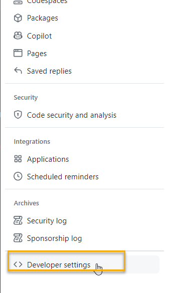
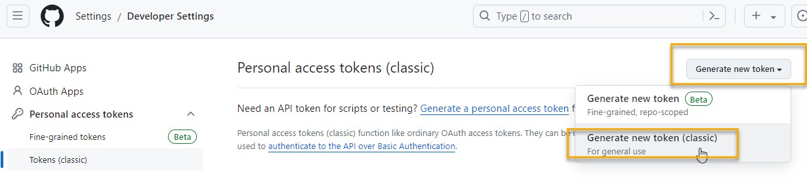
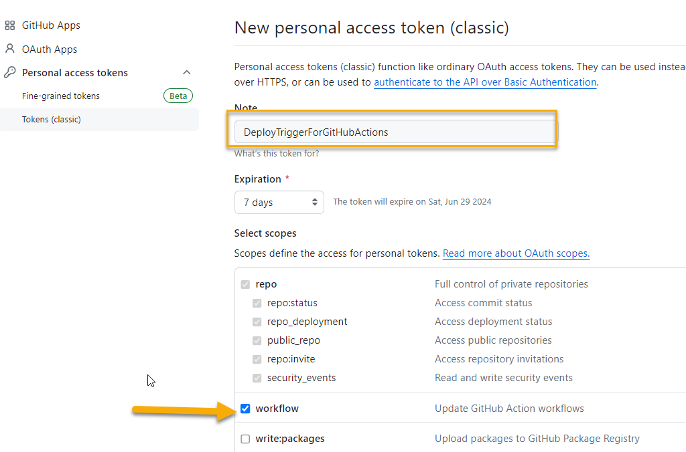
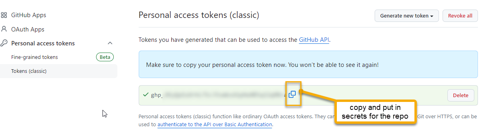
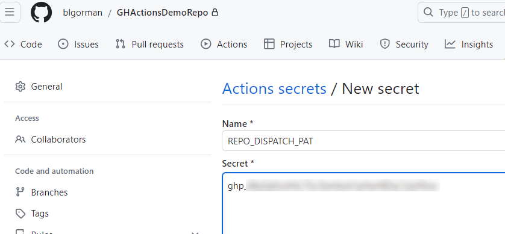
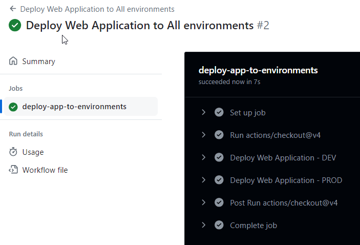

# Additional Considerations

There isn't enough time to cover all the capabilities of GitHub Actions in this workshop. Additionally, from this point on it starts to get very opinionated.  There are a number of additional things that you should consider to build a robust pipeline. Here are some additional capabilities that you might want to explore on your own:

## Table of Contents

- [Environments for branch protection, timer delays, and manual approvals](#environments-for-branch-protection)
- [Reusable workflows](#reusable-workflows)
- [Caching dependencies](#caching-dependencies)
- [Running jobs in a container](#running-jobs-in-a-container)
- [Code scanning](#code-scanning)
- [Package scanning](#package-scanning)
- [Secret Scanning](#secret-scanning)
- [Final Activity](#final-activity)
    - [Task 1: Create the reusable deployment workflow](#task-1-create-the-reusable-deployment-workflow)
    - [Task 2: Create a repository token](#task-2-create-a-repository-token)
    - [Task 3: Create the starter workflow](#task-3-create-the-starter-workflow)
    - [Task 4: Test the workflow](#task-4-test-the-workflow)
- [Conclusion](#conclusion)


## Environments for branch protection, timer delays, and manual approvals

You can leverage the existing branches to create protection rules and triggers, timer delays, and ensure that manual approvals are required before a deployment is made.

[using-environments-for-deployment](https://docs.github.com/actions/deployment/targeting-different-environments/using-environments-for-deployment)

## Reusable workflows

You can create one workflow that you can reuse to prevent duplication.

[Reusable workflows](https://docs.github.com/actions/using-workflows/reusing-workflows)

## Caching dependencies

You can cache dependencies to speed up the build process.

[Cache dependencies](https://docs.github.com/actions/using-workflows/caching-dependencies-to-speed-up-workflows)

## Running jobs in a container

Sometimes you need some specific tools that are not available in the GitHub Actions environment. You can run jobs in a container to have access to those tools.

[Running jobs in a container](https://docs.github.com/actions/using-workflows/workflow-syntax-for-github-actions#jobsjob_idcontainer)

## Code scanning

Security concerns were not addressed in this workshop. You can add code scanning to your workflow to ensure that your code is secure and doesn't have smells before deploying it.

[Code Scanning](https://docs.github.com/code-security/code-scanning/introduction-to-code-scanning/about-code-scanning)

## Package scanning

Package scanning is more a repository thing than a build thing, but it is important.

You can add package scanning to your workflow to ensure that the packages you are using are secure and don't have vulnerabilities.

Tools like Mend Bolt and the GitHub Dependabot can help you with this.

[Dependabot](https://docs.github.com/code-security/dependabot/dependabot-alerts/about-dependabot-alerts)  


## Secret Scanning

Secret scanning is a feature that scans your repositories for known secret formats and immediately notifies you if any are found.  

[Secret Scanning](https://docs.github.com/code-security/secret-scanning/about-secret-scanning)

[Git Guardian](https://www.gitguardian.com/)

## Final Activity

This final activity is very opinionated and may not be something you want to do.  It is a suggestion for a final activity to help you understand how to use GitHub Actions to deploy your application.

In this task, you will create a simple workflow that triggers on path and branch push that will deploy the application.  The workflow will 

### Task 1: Create the reusable deployment workflow

This could be done for either the architecture or the application (or both).  You will need to create a workflow that will start the process and it will then trigger the common deployment workflow twice, once for each environment.

The benefit of this is that you will not need to have both `dev` and `prod` stages in the workflow.  You can have a single stage that is triggered twice by the starter workflow.  This is also a benefit if you add additional environments in the future.

1. Create a new workflow file in the `.github/workflows` folder called `deployAppToEnvironment.yml`

    The contents of this file will be exactly the same as the other deployment workflow, but you will need to add a parameter to the workflow that will allow you to specify the environment.

    Additionally, you will only have one stage in the build.

    The trigger will be a `repository_dispatch` event, so it can only be done from another action.

    ```yaml
    name: Deploy Web Application To Any Environment By Dispatch Trigger
    run-name: Dispatch Trigger Deploy [${{ github.event.client_payload.environmentName }}] Web Application  

    on:
    repository_dispatch:
        types: [deploy-app-to-specific-environment]

    permissions:
        id-token: write
        contents: read

    env:
    DOTNET_VERSION: '6.x'
    AZURE_TENANT_ID:  ${{ secrets.AZURE_TENANT_ID }}

    jobs:
    build-and-deploy-app-to-environment:
        runs-on: ubuntu-latest
        environment:
        name: ${{ github.event.client_payload.environmentName }}
        defaults:
        run:
            working-directory: ./app
            
        steps:
        - uses: actions/checkout@v4

        - name: Set up .NET Core
            uses: actions/setup-dotnet@v4
            with:
            dotnet-version: ${{ env.DOTNET_VERSION }}

        - name: Build with dotnet
            run: dotnet build --configuration Release

        - name: dotnet publish
            run: dotnet publish -c Release -o ${{env.DOTNET_ROOT}}/myapp

        - name: Login to Azure
            uses: azure/login@v2
            with:
            client-id: ${{ secrets.AZURE_CLIENT_ID }}
            tenant-id: ${{ env.AZURE_TENANT_ID }}
            subscription-id: ${{ secrets.AZURE_SUBSCRIPTION_ID }}
    
        - name: Deploy to Azure Web App
            id: deploy-to-webapp
            uses: azure/webapps-deploy@v2
            with:
            app-name: ${{ vars.APP_NAME }}
            slot-name: ${{ vars.SLOT_NAME }}
            package: ${{ env.DOTNET_ROOT }}/myapp
    ```  

    >**Note:** Notice the name of the repository dispatch types `deploy-app-to-specific-environment`. This is the name that you will use in the dispatch.  It must match exactly to trigger the workflow.  

### Task 2: Create a repository token

In order to do the dispatch from the action, you'll need a repository token.  This is a token that is scoped to the repository and can be used to trigger workflows.

1. Create your token

    First you should create the token that is used to trigger the workflow.  You can do this in the settings of the repository under `Developer settings` -> `Personal access tokens`.

      

    Make sure to select the `classic` token until the fine-grained is out of beta.

    


    Select the `workflow` scope, which will select all on the `repo` scope.

      

    Copy the token to your clipboard.

      

1. Put your token into your secrets

    nce you have the token, put it in the secrets for the repository under a name like `REPO_DISPATCH_PAT`.

      

>**Note:** For more information, see the link below:  

[Managing your personal access tokens](https://docs.github.com/authentication/keeping-your-account-and-data-secure/managing-your-personal-access-tokens)


### Task 3: Create the starter workflow

To trigger the application deployment, you will need to create a workflow that will trigger the deployment workflow.  This will be a simple workflow that will trigger the deployment workflow for all environments.  In this manner, the code for the deployment is only in one place, and the starter workflow acts like an orchestrator.

1. Create a new workflow file in the `.github/workflows` folder called `appDeploymentOrchestrator.yml` [or something else that makes sense to you, the name is not important]

    The contents of this file will be a simple workflow that will trigger the deployment workflow for all environments.

    The trigger will be a `push` event on the `main` branch.

    ```yaml
    name: Deploy Web Application to All environments

    on:
    push:
        branches: [ main ]
        paths:
            - 'app/**/*'
    workflow_dispatch:

    permissions:
        id-token: write
        contents: read

    env: 
    REPO_PAT: ${{ secrets.REPO_DISPATCH_PAT }}
    CURRENT_BRANCH: ${{ github.ref }}
    
    jobs:
    deploy-app-to-environments:
        runs-on: ubuntu-latest
        
        steps:
        # Checkout code
        - uses: actions/checkout@v4
        with:
            ref: ${{ env.CURRENT_BRANCH }}

        # Dev Environment
        - name: Deploy Web Application - DEV
        uses: peter-evans/repository-dispatch@v2
        with:
            token: ${{ env.REPO_PAT }}
            repository: ${{ github.repository }}
            event-type: deploy-app-to-specific-environment
            client-payload: '{"ref": "${{ github.ref }}", "sha": "${{ github.sha }}", "branch": "${{ env.CURRENT_BRANCH }}", "environmentName": "dev"}'

        # Prod Environment
        - name: Deploy Web Application - PROD
        uses: peter-evans/repository-dispatch@v2
        with:
            token: ${{ env.REPO_PAT }}
            repository: ${{ github.repository }}
            event-type: deploy-app-to-specific-environment
            client-payload: '{"ref": "${{ github.ref }}", "sha": "${{ github.sha }}", "branch": "${{ env.CURRENT_BRANCH }}", "environmentName": "prod"}'
    ```  

    >**Note:** The `repository-dispatch` action is a community action that allows you to trigger workflows in other repositories.  notice how the action uses the `event-type` to name the specific dispatch `deploy-app-to-specific-environment`.  The file that is triggered must have the same `respository_dispatch: types [ deploy-app-to-specific-environment ]` trigger in the workflow file for the repository dispatch to work.

### Task 4: Test the workflow

1. Use the workflow dispatch to trigger the deployment to the environments.

    

1. You should see both deploying in parallel.

      

    >**Note:** IF you don't want to do parallel deployments, you can create two jobs in the orchestrator instead of one and add a `needs` to the second job to ensure that the first job completes before the second job starts.

## Conclusion

In this workshop you've learned how to do a number of important things with GitHub actions, starting from the ground up.

You learned how to create workflows that leverage environments and finished up with a suggestion for a final activity that will help you understand how to use GitHub Actions to deploy your application without having to duplicate code.
